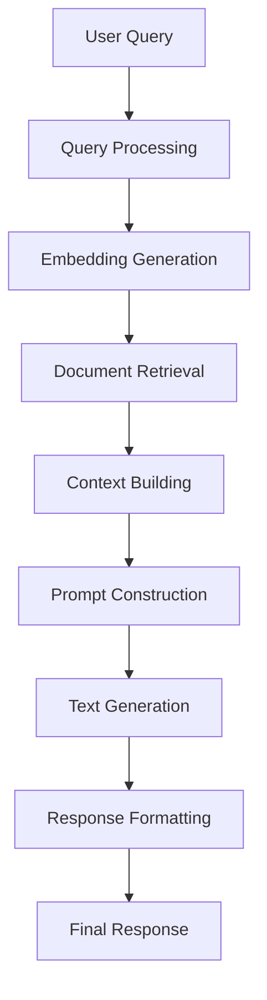

# RAG Application Architecture

## Overview

This RAG (Retrieval-Augmented Generation) **scaffolding** is built using **Domain-Driven Design (DDD)** and **Hexagonal Architecture** principles, providing a clean, production-ready foundation for RAG applications with clear separation between business logic and technical concerns.

## 🏗️ Architecture Layers (DDD + Hexagonal)

### 1. **Domain Layer** (`src/core/domain/`)

The **Domain Layer** represents the core business logic and rules of the RAG application. It contains the essential concepts and behaviors that define what the application does, independent of any technical implementation.

#### **Domain Models** (`src/core/domain/`)
Domain models represent the core business entities and value objects:

- **`rag.py`**: **Domain Models** (DDD-compliant structure)
  - **Entities**: Objects with identity and lifecycle
    - `DocumentChunk`: Document fragment entity with embeddings
    - `ProcessedQuery`: Rich query entity with business metadata
  - **Value Objects**: Immutable objects defined by their attributes
    - `RetrievalResult`: Document retrieval outcome with scoring
    - `RAGContext`: Complete generation context
    - `GenerationResult`: Text generation outcome with metrics
  - **Aggregates**: Consistency boundaries
    - `RAGResponse`: Complete response aggregate root
  - **Domain Enums**: Business concepts
    - `QueryType`: Business query classifications
    - `RetrievalStrategy`: Document retrieval approaches
    - `GenerationStrategy`: Text generation methods

#### **Domain Services** (Future: `src/core/domain/services/`)
*Planned for complex business logic that doesn't belong to a single entity:*
- `QueryAnalysisService`: Analyze and classify user queries
- `RelevanceCalculationService`: Calculate document relevance scores
- `ResponseValidationService`: Validate generated responses

### 2. **Application Layer** (`src/core/services/`)

The **Application Layer** orchestrates domain objects to fulfill business use cases. It contains application services that coordinate domain operations without containing business logic themselves.

#### **Application Services** (`src/core/services/`)
- **`rag_orchestrator.py`**: Main application service coordinating RAG workflows

#### **RAG Application Services** (`src/core/services/rag/`)
- **`embedding_service.py`**: Coordinate embedding generation workflows
- **`retrieval_service.py`**: Orchestrate document retrieval processes
- **`generation_service.py`**: Manage text generation workflows
- **`prompt_service.py`**: Handle prompt construction and optimization
- **`context_service.py`**: Manage RAG context assembly and validation
- **`pipeline.py`**: Coordinate complete RAG pipeline execution

### 3. **Domain Ports** (`src/core/ports/`)

**Ports** define the interfaces that the domain needs from the outside world, following the Dependency Inversion Principle.

#### **Repository Ports** (`src/core/ports/repositories.py`)
*Interfaces for data persistence (ready for database integration):*
- `DocumentRepository`: Document chunk storage and retrieval
- `QueryRepository`: Query persistence and analytics
- `ResponseRepository`: Response caching and metrics

#### **Service Ports** (`src/core/ports/services.py`)
*Interfaces for external services:*
- `EmbeddingService`: Text embedding generation
- `RetrievalService`: Document retrieval operations
- `GenerationService`: LLM text generation
- `PromptService`: Prompt construction and optimization
- `FormatterService`: Response formatting

### 4. **Infrastructure Layer** (`src/infrastructure/`)

The **Infrastructure Layer** provides concrete implementations of the ports defined by the domain, handling all technical concerns.

#### **Service Adapters** (`src/infrastructure/`)
- **`rag/langchain_implementations.py`**: LangChain-based implementations of RAG services
- **`langchain_services.py`**: Deprecated LangChain service implementations (for reference only)
- **`monitoring.py`**: Metrics collection and monitoring utilities
- **`dependencies.py`**: Dependency injection and configuration

#### **Repository Adapters** (Future: `src/infrastructure/persistence/`)
*Planned database implementations:*
- **`sqlalchemy/`**: SQL database implementations
  - `document_repository.py`: Document storage with PostgreSQL
  - `query_repository.py`: Query history with time-series data
  - `metrics_repository.py`: Performance metrics storage
- **`vector/`**: Vector database implementations
  - `faiss_repository.py`: FAISS vector store implementation
  - `pinecone_repository.py`: Pinecone cloud vector store
  - `chroma_repository.py`: ChromaDB implementation

### 5. **Interface Adapters** (`src/adapters/`)

**Adapters** translate between the domain and external systems, implementing the ports defined by the domain.

#### **Input Adapters** (`src/adapters/input/`)
*Handle incoming requests and translate them to domain operations:*
- **`api/`**: REST API adapters
  - `routers/`: FastAPI route handlers
  - `schemas/`: Request/Response DTOs (Data Transfer Objects)
  - `middleware/`: Cross-cutting concerns (logging, error handling)
- **`cli/`** (Future): Command-line interface adapters
- **`websocket/`** (Future): Real-time communication adapters

#### **Output Adapters** (`src/adapters/output/`)
*Handle outgoing operations and translate domain objects to external formats:*
- **`formatters.py`**: Response formatting (modern format only)
- **`logger.py`**: Structured logging configuration
- **`notifications/`** (Future): Email, webhook, and alert adapters

## 🔄 RAG Pipeline Flow



### Detailed Flow:

1. **Query Processing**: Convert raw query to `ProcessedQuery` with metadata
2. **Embedding Generation**: Generate query embeddings using `EmbeddingService`
3. **Document Retrieval**: Retrieve relevant chunks using `RetrievalService`
4. **Context Building**: Assemble RAG context using `ContextService`
5. **Prompt Construction**: Build optimized prompts using `PromptService`
6. **Text Generation**: Generate response using `GenerationService`
7. **Response Formatting**: Format final response for API

## 🎯 Key Components

### RAG Services

#### EmbeddingService
- **Purpose**: Generate embeddings for queries and documents
- **Features**: Batch processing, metrics tracking, model info
- **Implementation**: LangChain + OpenAI embeddings

#### RetrievalService
- **Purpose**: Retrieve relevant documents from vector store
- **Strategies**: Similarity, Hybrid, Semantic, Keyword
- **Features**: Filtering, scoring, deduplication

#### GenerationService
- **Purpose**: Generate text responses using LLMs
- **Strategies**: Standard, Chain-of-Thought, Step-by-Step, Creative
- **Features**: Streaming, citations, parameter optimization

#### PromptService
- **Purpose**: Construct and optimize prompts
- **Features**: Template management, context optimization, token limits
- **Templates**: Query-type specific templates

#### ContextService
- **Purpose**: Build and manage RAG context
- **Features**: Query-type optimization, validation, enrichment
- **Strategies**: Different context building per query type

### Pipeline Architecture

#### RAGPipeline
- **Purpose**: Orchestrate complete RAG flow
- **Features**: Health checks, metrics, error handling
- **Builder Pattern**: Flexible pipeline construction

#### RAGOrchestrator
- **Purpose**: High-level API for RAG operations
- **Features**: Parameter parsing, health checks, audit logging
- **Integration**: Coordinates with RAG pipeline and formatters

## 🔧 Configuration & Extensibility

### Query Types
- `QUESTION_ANSWERING`: Direct Q&A responses
- `SUMMARIZATION`: Document summarization
- `ANALYSIS`: Detailed analysis with reasoning
- `COMPARISON`: Comparative analysis
- `EXTRACTION`: Information extraction

### Generation Strategies
- `STANDARD`: Default generation approach
- `CHAIN_OF_THOUGHT`: Step-by-step reasoning
- `STEP_BY_STEP`: Detailed explanations
- `CREATIVE`: More creative responses

### Retrieval Strategies
- `SIMILARITY`: Vector similarity search
- `HYBRID`: Combined semantic + keyword
- `SEMANTIC`: Pure semantic search
- `KEYWORD`: Keyword-based search

## 📊 Monitoring & Metrics

### EmbeddingMetrics
- Total embeddings generated
- Token processing statistics
- Average processing time
- Batch size analytics

### GenerationMetrics
- Generation statistics
- Token usage tracking
- Strategy usage patterns
- Performance metrics

## 🏛️ Domain-Driven Design (DDD) Implementation

### **Domain Model Structure**

Our RAG application follows DDD principles with clear domain boundaries:

#### **Core Domain Concepts**
- **Document Processing**: The primary business capability
- **Query Understanding**: Analyzing and classifying user intents
- **Knowledge Retrieval**: Finding relevant information
- **Response Generation**: Creating contextual answers

#### **Bounded Contexts**
- **RAG Context**: Core retrieval and generation logic
- **Document Management**: Document ingestion and processing
- **Query Analytics**: Query patterns and performance metrics
- **User Interaction**: API and user interface concerns

#### **Domain Language (Ubiquitous Language)**
- **Query**: A user's information request
- **Document Chunk**: A semantically meaningful piece of a document
- **Retrieval**: The process of finding relevant information
- **Generation**: The process of creating responses
- **Context**: The assembled information used for generation
- **Relevance Score**: Measure of document-query alignment

### **Database Integration Readiness**

The architecture is prepared for database integration with clear separation of concerns:

#### **Repository Pattern Implementation**
```python
# Domain Port (Interface)
class DocumentRepository(ABC):
    async def save(self, document: DocumentChunk) -> str
    async def find_by_id(self, doc_id: str) -> Optional[DocumentChunk]
    async def find_by_query(self, query: ProcessedQuery) -> List[RetrievalResult]

# Infrastructure Implementation (Future)
class PostgreSQLDocumentRepository(DocumentRepository):
    # Concrete implementation with SQLAlchemy
```

#### **Planned Database Schema**
```sql
-- Documents table
CREATE TABLE documents (
    id UUID PRIMARY KEY,
    content TEXT NOT NULL,
    metadata JSONB,
    created_at TIMESTAMP DEFAULT NOW()
);

-- Document chunks table
CREATE TABLE document_chunks (
    id UUID PRIMARY KEY,
    document_id UUID REFERENCES documents(id),
    content TEXT NOT NULL,
    chunk_index INTEGER,
    embedding VECTOR(1536),  -- For pgvector
    metadata JSONB
);

-- Queries table (for analytics)
CREATE TABLE queries (
    id UUID PRIMARY KEY,
    original_text TEXT NOT NULL,
    processed_text TEXT,
    query_type VARCHAR(50),
    entities JSONB,
    keywords JSONB,
    created_at TIMESTAMP DEFAULT NOW()
);

-- RAG responses table (for analytics and caching)
CREATE TABLE rag_responses (
    id UUID PRIMARY KEY,
    query_id UUID REFERENCES queries(id),
    answer TEXT NOT NULL,
    confidence_score FLOAT,
    tokens_used INTEGER,
    processing_time_ms INTEGER,
    created_at TIMESTAMP DEFAULT NOW()
);
```

## �  Scaffolding Benefits

This RAG scaffolding provides a clean, production-ready foundation:

### **Clean Architecture**
- **No Legacy Code**: Pure DDD implementation from the start
- **Modern Patterns**: Repository pattern, dependency injection, hexagonal architecture
- **Type Safety**: Full type hints and validation throughout
- **Extensible Design**: Easy to add new features and integrations

### **Database Ready**
- **Repository Interfaces**: Ready for any database implementation
- **Schema Planned**: PostgreSQL, vector databases, analytics tables
- **Performance Optimized**: Designed for scalable data access patterns
- **Multiple Storage Options**: SQL, NoSQL, vector databases supported

## 🚀 Benefits of DDD + Hexagonal Architecture

### **Domain-Driven Design Benefits**
1. **Business Focus**: Architecture reflects business concepts and language
2. **Domain Isolation**: Core business logic independent of technical concerns
3. **Ubiquitous Language**: Consistent terminology across team and code
4. **Bounded Contexts**: Clear boundaries between different business areas
5. **Rich Domain Models**: Entities and value objects encapsulate business rules

### **Hexagonal Architecture Benefits**
6. **Technology Independence**: Easy to swap infrastructure components
7. **Testability**: Domain logic can be tested without external dependencies
8. **Flexibility**: Multiple adapters for different interfaces (REST, CLI, etc.)
9. **Maintainability**: Clear separation of concerns and dependencies
10. **Extensibility**: New features can be added without affecting existing code

### **Database Integration Benefits**
11. **Persistence Flexibility**: Can use SQL, NoSQL, or vector databases
12. **Performance Optimization**: Optimized queries for different data access patterns
13. **Data Consistency**: Repository pattern ensures data integrity
14. **Scalability**: Database layer can be scaled independently
15. **Analytics Ready**: Query and response data available for analysis

## ✅ **Testing & Quality Assurance**

### Test Coverage
- **100% test coverage** for core RAG components
- **Unit tests** for all services and orchestrators
- **Integration tests** for API endpoints
- **Schema validation tests** for request/response models
- **Mock implementations** for external dependencies

### Test Structure
```
tests/
├── conftest.py           # Test configuration and fixtures
├── mocks.py             # Mock implementations of RAG services
├── test_api.py          # API endpoint tests
├── test_orchestrator.py # RAG orchestrator tests
└── test_schemas.py      # Pydantic schema validation tests
```

### Quality Tools
- **pytest**: Testing framework with async support
- **pytest-cov**: Code coverage reporting
- **ruff**: Fast linting and code formatting
- **black**: Code formatting
- **mypy**: Static type checking
- **pre-commit**: Git hooks for quality assurance

## 🔮 Future Enhancements

### **Domain Evolution**
- **Multi-modal RAG**: Extend domain models for images, audio, video
- **Advanced Query Types**: Add new business query classifications
- **Domain Events**: Implement event-driven architecture for complex workflows
- **Aggregate Optimization**: Refine aggregate boundaries based on usage patterns

### **Database & Persistence**
- **Vector Database Integration**: Pinecone, Weaviate, or Qdrant implementations
- **Time-series Analytics**: Query performance and usage pattern analysis
- **Caching Layer**: Redis-based intelligent response caching
- **Data Partitioning**: Horizontal scaling for large document collections
- **Backup & Recovery**: Automated backup strategies for critical data

### **Technical Enhancements**
- **Real-time Streaming**: WebSocket support for streaming responses
- **Multi-tenant Architecture**: Support for multiple organizations with data isolation
- **Advanced Retrieval**: Graph-based and temporal retrieval strategies
- **Model Routing**: Dynamic LLM selection based on query characteristics
- **A/B Testing Framework**: Compare different RAG strategies and models

### **Monitoring & Observability**
- **Domain Metrics**: Business-focused metrics and KPIs
- **Distributed Tracing**: End-to-end request tracing across components
- **Performance Profiling**: Detailed performance analysis and optimization
- **Alerting System**: Proactive monitoring and incident response

### **Developer Experience**
- **Domain Documentation**: Living documentation of business rules and concepts
- **Migration Tools**: Automated tools for legacy to modern model migration
- **Testing Framework**: Domain-specific testing utilities and fixtures
- **API Versioning**: Graceful API evolution and backward compatibility